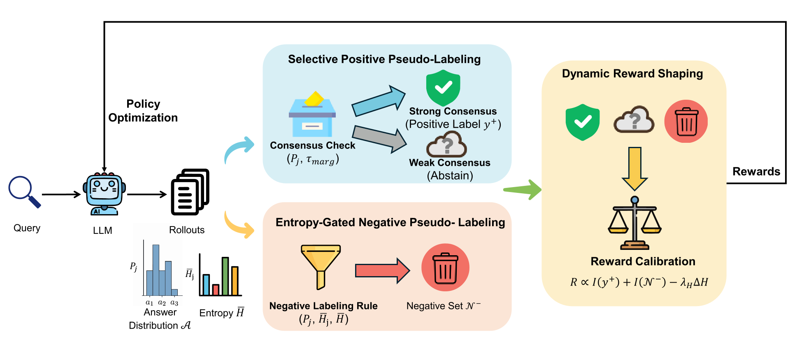

<div align="center">

<h1>What If Consensus Lies? Selective-Complementary Reinforcement Learning at Test Time</h1>

<p>
  Dong Yan<sup>1,2</sup>, 
  Jian Liang<sup>1,2*</sup>, 
  Yanbo Wang<sup>1,2</sup>,
  Shuo Lu<sup>2</sup>,
  Ran He<sup>1,2</sup>, 
  Tieniu Tan<sup>1,2,3</sup>
</p>

<p>
  <sup>1</sup>School of Artificial Intelligence, University of Chinese Academy of Sciences<br>
  <sup>2</sup>NLPR & MAIS, Institute of Automation, Chinese Academy of Sciences<br>
  <sup>3</sup>Nanjing University
</p>

<p>
  <code>yandong2025@ia.ac.cn</code>, <code>liangjian92@gmail.com</code>
</p>

</div>

## 🚀 News
* **[2026/04]** SCRL is accepted by ACL 2026 Main Conference!
* **[2026/04]** The code of SCRL was released!
* **[2026/03]** Code is under preparation. Stay tuned!
* **[2026/03]** SCRL paper was released on [arXiv](https://arxiv.org/abs/2603.19880)!

## 📖 Overview
We propose SCRL (Selective-Complementary Reinforcement Learning), a robust test-time reinforcement learning framework that effectively mitigates label noise amplification.
SCRL develops Selective Positive Pseudo-Labeling, which enforces strict consensus criteria to filter unreliable majorities. 
Complementarily, SCRL introduces Entropy-Gated Negative Pseudo-Labeling, the first negative supervision mechanism in TTRL, to reliably prune incorrect trajectories based on generation uncertainty. 
Extensive experiments on multiple reasoning benchmarks demonstrate that SCRL achieves substantial improvements over baselines, while maintaining robust generalization and training stability under constrained rollout budgets.

<div align="center">
  
</div>

## ⚡️ Getting Started

### Environment Setup

```bash
git clone https://github.com/Jasper-Yan/SCRL.git

cd SCRL/verl
conda create -n scrl python==3.10
conda activate scrl
bash install_deps.sh
pip install -e .
```

### Training

#### 1. Convert JSON to Parquet (for verl)

Use the preprocessing script in `verl/data/preprocess.py` to convert dataset files from JSON to Parquet.

#### 2. Launch training

Before launching, update key paths in `verl/run_example.sh`:

- `DATA_LOCAL_DIR`: set to your local data root
- `BACKBONE_PATH`: set to your local model path
- `TASK`: set to your dataset name
- `WANDB_API_KEY`: optional if you use Weights & Biases logging

Then run:

```bash
bash run_example.sh
```

## 🙏 Acknowledgement
This work is based on [TTRL](https://github.com/PRIME-RL/TTRL) and [veRL](https://github.com/verl-project/verl). We sincerely thank the authors and contributors of these excellent open-source projects.

## 📚 Citation
If you find our work helpful, please consider citing:

```bibtex
@article{yan2026if,
  title={What If Consensus Lies? Selective-Complementary Reinforcement Learning at Test Time},
  author={Yan, Dong and Liang, Jian and Wang, Yanbo and Lu, Shuo and He, Ran and Tan, Tieniu},
  journal={arXiv preprint arXiv:2603.19880},
  year={2026}
}
```

## 📄 License
This project is licensed under the MIT License.
